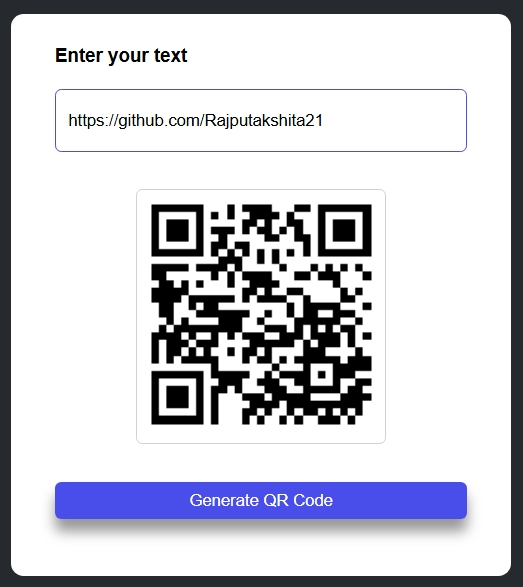
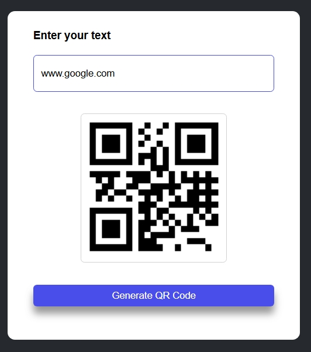
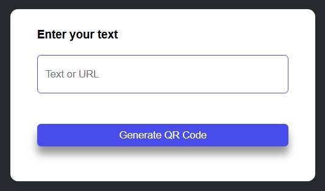
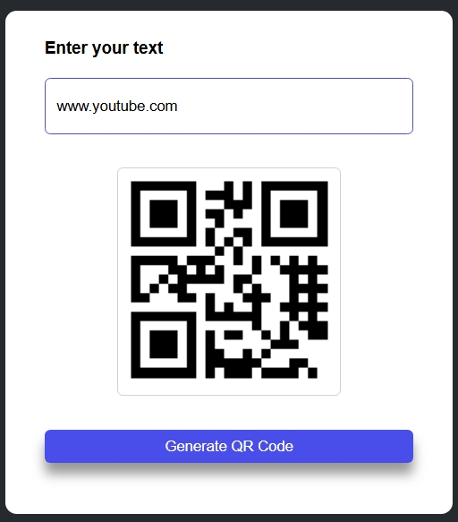

<h1 align="center"> Weather WebApp</h1>
A lightweight, modern, and responsive web application that instantly converts text or URLs into high-quality QR codes.

<table align="center">
  <tr>
    <td></td>
    <td></td>
  </tr>
</table>

## Features
Generate QR codes instantly

Supports text, URLs, and other data

Simple and user-friendly interface

Built with pure HTML, CSS, and JavaScript

No backend required

## Technologies Used
HTML5 – Structure of the application

CSS3 – Styling and responsive design

JavaScript – QR code generation and functionality

QR Code API/Library – Used to generate QR codes

## How to Use
Open the QR Code Generator.

Enter a URL, text, phone number, email, or any other supported information.

Click the Generate QR Code button.

Your QR code will appear on the screen.

Scan the generated QR code.

## Preview

